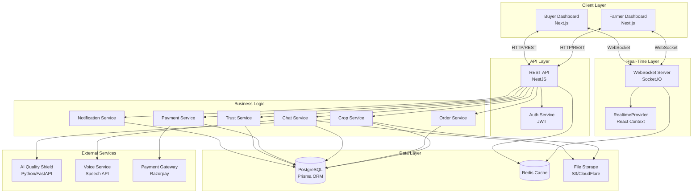
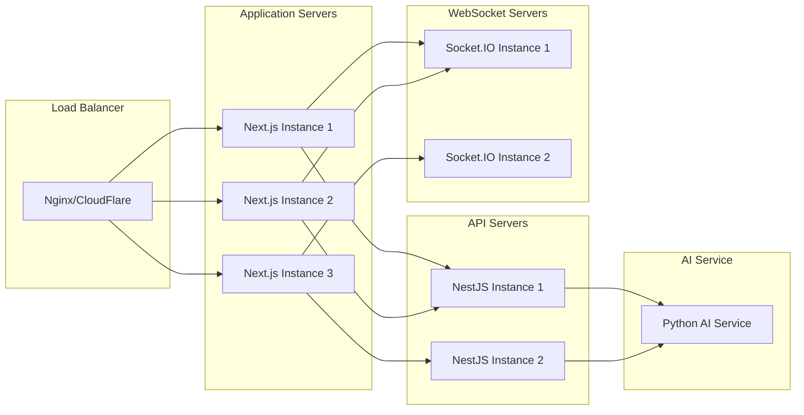

# Design Document: Real-Time Marketplace Ecosystem

## Overview

This design document specifies the technical architecture for transforming the Farmguard platform into a comprehensive real-time agricultural marketplace ecosystem. The system enables direct farmer-to-buyer trade with instant updates, AI-powered quality analysis, real-time messaging, voice capabilities, secure payments, and trust-based reputation management.

The platform consists of two primary user interfaces (Farmer Dashboard and Buyer Dashboard) connected through a real-time WebSocket infrastructure that ensures all events propagate within 2 seconds. The system leverages Socket.IO for bidirectional communication, Next.js for the frontend, NestJS for the backend API, PostgreSQL with Prisma ORM for data persistence, and a Python-based AI service for quality analysis.

### Key Design Principles

1. **Real-Time First**: All critical user interactions must provide instant feedback through WebSocket events
2. **Mobile Responsive**: Both dashboards must work seamlessly on mobile devices for field use
3. **Multilingual Support**: Full support for English, Hindi, and Marathi throughout the platform
4. **Scalability**: Architecture must support minimum 10,000 concurrent users
5. **Security**: End-to-end encryption for sensitive data, JWT-based authentication, role-based access control
6. **Reliability**: Graceful degradation when real-time features are unavailable, automatic reconnection logic

## Architecture

### System Architecture Diagram



### Technology Stack

**Frontend:**
- Next.js 14 (App Router)
- React 18 with TypeScript
- TailwindCSS for styling
- Socket.IO Client for real-time
- Zustand for state management
- React Query for server state
- i18next for internationalization

**Backend:**
- NestJS with TypeScript
- Socket.IO Server for WebSockets
- Prisma ORM with PostgreSQL
- JWT for authentication
- Bcrypt for password hashing

**AI Service:**
- Python 3.11
- FastAPI framework
- TensorFlow/PyTorch for quality detection
- OpenCV for image processing

**Infrastructure:**
- PostgreSQL 15 for primary database
- Redis for caching and session management
- S3-compatible storage for images/files
- Razorpay for payment processing

### Deployment Architecture



## Components and Interfaces

### Frontend Components

#### 1. Farmer Dashboard Components

**SmartProductHub**
- Purpose: Manage crop listings with images, pricing, and quality grades
- Props: `userId: string, onProductCreated: (product: Product) => void`
- State: `products: Product[], loading: boolean, error: string | null`
- Real-time: Listens to `product:created`, `product:updated`, `product:deleted` events

**OrderControlCenter**
- Purpose: View and manage incoming orders with status tracking
- Props: `farmerId: string`
- State: `orders: Order[], selectedOrder: Order | null, statusFilter: OrderStatus`
- Real-time: Listens to `order:new`, `order:status:updated` events

**AgriChatAdvanced**
- Purpose: Real-time messaging with buyers, typing indicators, read receipts
- Props: `conversationId: string, currentUserId: string`
- State: `messages: Message[], isTyping: boolean, onlineStatus: boolean`
- Real-time: Listens to `message:new`, `message:typing`, `message:read`, `user:online` events

**CropQualityDetector**
- Purpose: Upload images for AI quality analysis
- Props: `productId: string, onAnalysisComplete: (result: QualityResult) => void`
- State: `uploading: boolean, analyzing: boolean, result: QualityResult | null`
- Real-time: Listens to `quality:scan:complete` events

**FarmInsights**
- Purpose: Display analytics on sales, earnings, and performance
- Props: `farmerId: string, dateRange: DateRange`
- State: `analytics: FarmerAnalytics, loading: boolean`
- Real-time: Listens to `analytics:updated` events

#### 2. Buyer Dashboard Components

**SmartSourcingEnhanced**
- Purpose: Browse marketplace with search, filters, and real-time updates
- Props: `buyerId: string`
- State: `products: Product[], filters: FilterState, searchQuery: string`
- Real-time: Listens to `product:created`, `product:updated`, `price:updated` events

**OrderTracker**
- Purpose: Track order status with real-time location updates
- Props: `buyerId: string, orderId?: string`
- State: `orders: Order[], tracking: TrackingInfo[], selectedOrder: Order | null`
- Real-time: Listens to `order:status:updated`, `order:location:updated` events

**NegotiationHubPremium**
- Purpose: Chat with farmers and negotiate prices
- Props: `buyerId: string, farmerId: string, productId: string`
- State: `conversation: Conversation, messages: Message[], proposal: Proposal | null`
- Real-time: Listens to `message:new`, `proposal:counter`, `proposal:accepted` events

**SupplierInsights**
- Purpose: View farmer profiles, ratings, and product history
- Props: `supplierId: string`
- State: `supplier: Supplier, products: Product[], ratings: Rating[]`
- Real-time: Listens to `supplier:updated`, `rating:new` events

**BuyerInsightsDashboard**
- Purpose: Market trends, price alerts, and recommendations
- Props: `buyerId: string`
- State: `insights: BuyerInsights, priceAlerts: PriceAlert[], recommendations: Product[]`
- Real-time: Listens to `price:alert`, `recommendation:new` events

### Backend Services

#### 1. Crop Service

**Responsibilities:**
- CRUD operations for crop listings
- Image upload and management
- Quality grade assignment
- Real-time broadcast of crop changes

**Key Methods:**
```typescript
interface CropService {
  createCrop(data: CreateCropDto, farmerId: string): Promise<Product>
  updateCrop(id: string, data: UpdateCropDto): Promise<Product>
  deleteCrop(id: string): Promise<void>
  getCropById(id: string): Promise<Product>
  searchCrops(filters: CropFilters): Promise<Product[]>
  updateQualityGrade(id: string, grade: QualityGrade): Promise<Product>
}
```

**Real-time Events Emitted:**
- `product:created` - When new crop is added
- `product:updated` - When crop details change
- `product:deleted` - When crop is removed
- `product:quality:updated` - When AI analysis completes

#### 2. Order Service

**Responsibilities:**
- Order creation and lifecycle management
- Status transitions and validation
- Order tracking and location updates
- Invoice generation

**Key Methods:**
```typescript
interface OrderService {
  createOrder(data: CreateOrderDto): Promise<Order>
  updateOrderStatus(id: string, status: OrderStatus): Promise<Order>
  getOrderById(id: string): Promise<Order>
  getOrdersByFarmer(farmerId: string): Promise<Order[]>
  getOrdersByBuyer(buyerId: string): Promise<Order[]>
  addTrackingUpdate(orderId: string, data: TrackingUpdate): Promise<OrderTracking>
  cancelOrder(id: string, userId: string): Promise<Order>
}
```

**Real-time Events Emitted:**
- `order:new` - When order is placed (to farmer)
- `order:status:updated` - When status changes (to both parties)
- `order:location:updated` - When tracking location updates
- `order:cancelled` - When order is cancelled

#### 3. Chat Service (AgriChat)

**Responsibilities:**
- Message delivery and persistence
- Typing indicators
- Read receipts
- File/image/voice message handling
- Conversation history and search

**Key Methods:**
```typescript
interface ChatService {
  sendMessage(data: SendMessageDto): Promise<Message>
  getConversation(user1Id: string, user2Id: string): Promise<Conversation>
  getMessages(conversationId: string, pagination: Pagination): Promise<Message[]>
  markAsRead(messageId: string, userId: string): Promise<void>
  searchMessages(query: string, userId: string): Promise<Message[]>
  uploadAttachment(file: File, conversationId: string): Promise<string>
}
```

**Real-time Events Emitted:**
- `message:new` - When message is sent
- `message:typing` - When user is typing
- `message:read` - When message is read
- `user:online` - When user comes online
- `user:offline` - When user goes offline

#### 4. Payment Service

**Responsibilities:**
- Payment initiation and processing
- Payment status tracking
- Invoice generation
- Transaction history
- Integration with Razorpay

**Key Methods:**
```typescript
interface PaymentService {
  initiatePayment(orderId: string, amount: number): Promise<PaymentIntent>
  verifyPayment(paymentId: string, signature: string): Promise<Payment>
  getPaymentStatus(paymentId: string): Promise<PaymentStatus>
  generateInvoice(orderId: string): Promise<Invoice>
  getTransactionHistory(userId: string): Promise<Transaction[]>
}
```

**Real-time Events Emitted:**
- `payment:initiated` - When payment starts
- `payment:success` - When payment succeeds
- `payment:failed` - When payment fails
- `invoice:generated` - When invoice is created

#### 5. Trust Service

**Responsibilities:**
- Rating submission and calculation
- Reputation score management
- Review moderation
- Trust badge assignment

**Key Methods:**
```typescript
interface TrustService {
  submitRating(data: SubmitRatingDto): Promise<Rating>
  calculateReputationScore(userId: string): Promise<number>
  getRatings(userId: string): Promise<Rating[]>
  flagRating(ratingId: string, reason: string): Promise<void>
  getUserReputation(userId: string): Promise<Reputation>
}
```

**Real-time Events Emitted:**
- `rating:new` - When rating is submitted
- `reputation:updated` - When reputation score changes
- `trust:badge:earned` - When user earns trust badge

#### 6. Notification Service

**Responsibilities:**
- Notification creation and delivery
- Notification preferences management
- Push notification integration
- Notification history

**Key Methods:**
```typescript
interface NotificationService {
  createNotification(data: CreateNotificationDto): Promise<Notification>
  sendNotification(userId: string, notification: Notification): Promise<void>
  getNotifications(userId: string, unreadOnly: boolean): Promise<Notification[]>
  markAsRead(notificationId: string): Promise<void>
  updatePreferences(userId: string, preferences: NotificationPreferences): Promise<void>
}
```

**Real-time Events Emitted:**
- `notification:new` - When notification is created
- `notification:read` - When notification is read

#### 7. AI Quality Shield Service

**Responsibilities:**
- Image analysis for quality grading
- Defect detection and classification
- Confidence score calculation
- Quality certificate generation

**Key Methods:**
```typescript
interface AIQualityService {
  analyzeImage(imageUrl: string, productId: string): Promise<QualityAnalysis>
  detectDefects(imageUrl: string): Promise<Defect[]>
  generateCertificate(analysisId: string): Promise<Certificate>
  getAnalysisHistory(productId: string): Promise<QualityAnalysis[]>
}
```

**Real-time Events Emitted:**
- `quality:scan:started` - When analysis begins
- `quality:scan:complete` - When analysis finishes
- `quality:certificate:generated` - When certificate is created

#### 8. Voice Service

**Responsibilities:**
- Speech-to-text conversion
- Text-to-speech conversion
- Voice message recording and playback
- Multi-language support

**Key Methods:**
```typescript
interface VoiceService {
  speechToText(audioFile: File, language: Language): Promise<string>
  textToSpeech(text: string, language: Language): Promise<AudioBuffer>
  recordVoiceMessage(audioFile: File, conversationId: string): Promise<Message>
  processVoiceCommand(audioFile: File, language: Language): Promise<Command>
}
```

## Data Models

### Core Entities

#### User
```prisma
model User {
  id                String    @id @default(uuid())
  email             String    @unique
  password          String
  name              String
  role              Role      @default(FARMER)
  phone             String?
  address           String?
  district          String?
  state             String?
  language          Language  @default(ENGLISH)
  kycStatus         KycStatus @default(PENDING)
  reputationScore   Float     @default(0)
  isActive          Boolean   @default(true)
  lastSeen          DateTime?
  createdAt         DateTime  @default(now())
  updatedAt         DateTime  @updatedAt
  
  // Relations
  products          Product[]
  ordersAsFarmer    Order[]   @relation("FarmerOrders")
  ordersAsBuyer     Order[]   @relation("BuyerOrders")
  sentMessages      Message[] @relation("SentMessages")
  receivedMessages  Message[] @relation("ReceivedMessages")
  ratingsGiven      Rating[]  @relation("RatingsGiven")
  ratingsReceived   Rating[]  @relation("RatingsReceived")
  notifications     Notification[]
  payments          Payment[]
  
  @@index([email])
  @@index([role])
  @@index([reputationScore])
}

enum Role {
  FARMER
  BUYER
  ADMIN
}

enum Language {
  ENGLISH
  HINDI
  MARATHI
}

enum KycStatus {
  PENDING
  VERIFIED
  REJECTED
}
```

#### Product (Crop)
```prisma
model Product {
  id              String    @id @default(uuid())
  name            String
  category        String
  description     String?
  imageUrls       Json      // Array of image URLs
  price           Float
  quantity        Float
  unit            String    @default("kg")
  qualityGrade    String?   // A+, A, B+, B
  qualityScore    Float?    // 0-100
  district        String?
  state           String?
  isActive        Boolean   @default(true)
  farmerId        String
  createdAt       DateTime  @default(now())
  updatedAt       DateTime  @updatedAt
  
  // Relations
  farmer          User      @relation(fields: [farmerId], references: [id], onDelete: Cascade)
  orders          Order[]
  qualityScans    QualityScan[]
  favorites       Favorite[]
  
  @@index([farmerId])
  @@index([category])
  @@index([qualityGrade])
  @@index([isActive])
}
```

#### Order
```prisma
model Order {
  id              String      @id @default(uuid())
  orderNumber     String      @unique
  productId       String
  farmerId        String
  buyerId         String
  quantity        Float
  totalPrice      Float
  status          OrderStatus @default(PENDING)
  notes           String?
  createdAt       DateTime    @default(now())
  updatedAt       DateTime    @updatedAt
  
  // Relations
  product         Product     @relation(fields: [productId], references: [id])
  farmer          User        @relation("FarmerOrders", fields: [farmerId], references: [id])
  buyer           User        @relation("BuyerOrders", fields: [buyerId], references: [id])
  tracking        OrderTracking[]
  payment         Payment?
  rating          Rating?
  
  @@index([farmerId])
  @@index([buyerId])
  @@index([status])
  @@index([orderNumber])
}

enum OrderStatus {
  PENDING
  ACCEPTED
  REJECTED
  IN_TRANSIT
  DELIVERED
  COMPLETED
  CANCELLED
}
```

#### OrderTracking
```prisma
model OrderTracking {
  id              String    @id @default(uuid())
  orderId         String
  status          OrderStatus
  location        String?
  lat             Float?
  lng             Float?
  notes           String?
  estimatedTime   DateTime?
  actualTime      DateTime?
  createdAt       DateTime  @default(now())
  
  // Relations
  order           Order     @relation(fields: [orderId], references: [id], onDelete: Cascade)
  
  @@index([orderId])
}
```

#### Message (AgriChat)
```prisma
model Message {
  id              String      @id @default(uuid())
  conversationId  String
  senderId        String
  receiverId      String
  content         String
  type            MessageType @default(TEXT)
  attachmentUrl   String?
  isRead          Boolean     @default(false)
  readAt          DateTime?
  createdAt       DateTime    @default(now())
  
  // Relations
  conversation    Conversation @relation(fields: [conversationId], references: [id], onDelete: Cascade)
  sender          User         @relation("SentMessages", fields: [senderId], references: [id])
  receiver        User         @relation("ReceivedMessages", fields: [receiverId], references: [id])
  
  @@index([conversationId])
  @@index([senderId])
  @@index([receiverId])
  @@index([isRead])
}

model Conversation {
  id              String    @id @default(uuid())
  user1Id         String
  user2Id         String
  lastMessageAt   DateTime?
  createdAt       DateTime  @default(now())
  
  // Relations
  messages        Message[]
  
  @@unique([user1Id, user2Id])
  @@index([user1Id])
  @@index([user2Id])
}

enum MessageType {
  TEXT
  IMAGE
  VOICE
  FILE
}
```

#### Payment
```prisma
model Payment {
  id              String        @id @default(uuid())
  orderId         String        @unique
  userId          String
  amount          Float
  currency        String        @default("INR")
  status          PaymentStatus @default(PENDING)
  paymentMethod   String?
  razorpayOrderId String?
  razorpayPaymentId String?
  razorpaySignature String?
  invoiceUrl      String?
  createdAt       DateTime      @default(now())
  updatedAt       DateTime      @updatedAt
  
  // Relations
  order           Order         @relation(fields: [orderId], references: [id])
  user            User          @relation(fields: [userId], references: [id])
  
  @@index([orderId])
  @@index([userId])
  @@index([status])
}

enum PaymentStatus {
  PENDING
  PROCESSING
  PAID
  FAILED
  REFUNDED
}
```

#### Rating
```prisma
model Rating {
  id              String    @id @default(uuid())
  orderId         String    @unique
  fromUserId      String
  toUserId        String
  stars           Int       // 1-5
  review          String?
  createdAt       DateTime  @default(now())
  
  // Relations
  order           Order     @relation(fields: [orderId], references: [id])
  fromUser        User      @relation("RatingsGiven", fields: [fromUserId], references: [id])
  toUser          User      @relation("RatingsReceived", fields: [toUserId], references: [id])
  
  @@index([toUserId])
  @@index([stars])
}
```

#### QualityScan
```prisma
model QualityScan {
  id              String    @id @default(uuid())
  productId       String
  imageUrl        String
  grade           String    // A+, A, B+, B
  score           Float     // 0-100
  confidence      Float     // 0-100
  defects         Json?     // Array of detected defects
  certificateUrl  String?
  createdAt       DateTime  @default(now())
  
  // Relations
  product         Product   @relation(fields: [productId], references: [id], onDelete: Cascade)
  
  @@index([productId])
  @@index([grade])
}
```

#### Notification
```prisma
model Notification {
  id              String           @id @default(uuid())
  userId          String
  type            NotificationType
  title           String
  message         String
  metadata        Json?
  isRead          Boolean          @default(false)
  readAt          DateTime?
  createdAt       DateTime         @default(now())
  
  // Relations
  user            User             @relation(fields: [userId], references: [id], onDelete: Cascade)
  
  @@index([userId])
  @@index([isRead])
  @@index([type])
}

enum NotificationType {
  ORDER
  MESSAGE
  PAYMENT
  QUALITY
  RATING
  SYSTEM
}
```

#### Favorite
```prisma
model Favorite {
  id              String    @id @default(uuid())
  buyerId         String
  farmerId        String
  notes           String?
  createdAt       DateTime  @default(now())
  
  @@unique([buyerId, farmerId])
  @@index([buyerId])
  @@index([farmerId])
}
```

### Database Indexes

Critical indexes for performance:
- User: `email`, `role`, `reputationScore`
- Product: `farmerId`, `category`, `qualityGrade`, `isActive`
- Order: `farmerId`, `buyerId`, `status`, `orderNumber`
- Message: `conversationId`, `senderId`, `receiverId`, `isRead`
- Notification: `userId`, `isRead`, `type`

## Correctness Properties

*A property is a characteristic or behavior that should hold true across all valid executions of a system—essentially, a formal statement about what the system should do. Properties serve as the bridge between human-readable specifications and machine-verifiable correctness guarantees.*

### Property 1: Crop Creation Completeness

*For any* valid crop data with name, category, price, quantity, and images, creating a crop SHALL persist all provided fields and return a crop object containing all submitted values.

**Validates: Requirements 1.1**

### Property 2: Price Validation

*For any* crop price value, the system SHALL accept only prices greater than zero and reject zero or negative prices.

**Validates: Requirements 1.3**

### Property 3: Category Validation

*For any* crop category string, the system SHALL accept only "fruit", "vegetable", or "grain" categories and reject all other values.

**Validates: Requirements 1.4**

### Property 4: Crop Deletion Notification

*For any* crop that has been favorited by buyers, deleting the crop SHALL remove the listing and create notifications for all buyers who favorited it.

**Validates: Requirements 1.6**

### Property 5: Out of Stock Automation

*For any* crop, when quantity is set to zero, the system SHALL automatically mark isActive as false.

**Validates: Requirements 1.8**

### Property 6: Quality Grade Validation

*For any* quality analysis result, the returned grade SHALL be one of "A+", "A", "B+", or "B".

**Validates: Requirements 2.2**

### Property 7: Confidence Range Validation

*For any* quality analysis result, the confidence percentage SHALL be between 0 and 100 inclusive.

**Validates: Requirements 2.3**

### Property 8: Defect Structure Validation

*For any* quality analysis result with detected defects, each defect SHALL contain type and location fields.

**Validates: Requirements 2.4**

### Property 9: Certificate Generation for High Grades

*For any* quality scan with grade "A+" or "A", the system SHALL generate a quality certificate; for grades "B+" or "B", no certificate SHALL be generated.

**Validates: Requirements 2.6**

### Property 10: Quality Scan Persistence

*For any* quality scan performed on a crop, the scan result SHALL be stored and retrievable from the crop's scan history.

**Validates: Requirements 2.8**

### Property 11: Active Crop Filtering

*For any* marketplace query, the returned crops SHALL include only crops where isActive is true.

**Validates: Requirements 3.1**

### Property 12: Keyword Search Matching

*For any* search query string, the returned crops SHALL have names or categories that match the query string.

**Validates: Requirements 3.2**

### Property 13: Price Range Filtering

*For any* price range filter with minimum and maximum values, all returned crops SHALL have prices within the specified range inclusive.

**Validates: Requirements 3.3**

### Property 14: Distance Filtering

*For any* location filter with distance radius, all returned crops SHALL be within the specified distance from the buyer's location.

**Validates: Requirements 3.4**

### Property 15: Quality Grade Filtering

*For any* quality grade filter, all returned crops SHALL have matching quality grades.

**Validates: Requirements 3.5**

### Property 16: Category Filtering

*For any* category filter, all returned crops SHALL have matching categories.

**Validates: Requirements 3.6**

### Property 17: Marketplace Response Completeness

*For any* crop in marketplace results, the response SHALL include imageUrls, price, quantity, farmer name, and qualityGrade fields.

**Validates: Requirements 3.8**

### Property 18: Order Initial Status

*For any* newly created order, the initial status SHALL be "PENDING".

**Validates: Requirements 4.1**

### Property 19: Order Acceptance Transition

*For any* order in PENDING status, accepting the order SHALL update status to "ACCEPTED".

**Validates: Requirements 4.3**

### Property 20: Order Rejection with Notification

*For any* order in PENDING status, rejecting the order SHALL update status to "REJECTED" and create a notification for the buyer.

**Validates: Requirements 4.4**

### Property 21: Valid Order Status Transitions

*For any* order, status transitions SHALL follow the valid state machine: PENDING → ACCEPTED → IN_TRANSIT → DELIVERED → COMPLETED, and invalid transitions SHALL be rejected.

**Validates: Requirements 4.6**

### Property 22: Tracking Updates for In-Transit Orders

*For any* order with status IN_TRANSIT, adding tracking updates SHALL succeed and the updates SHALL be stored and retrievable.

**Validates: Requirements 4.7**

### Property 23: Message Read Status

*For any* message, marking it as read SHALL set isRead to true and populate readAt with the current timestamp.

**Validates: Requirements 5.3**

### Property 24: Message Length Validation

*For any* text message, the system SHALL accept messages with length <= 5000 characters and reject messages with length > 5000 characters.

**Validates: Requirements 5.4**

### Property 25: Order Context Linking

*For any* message sent in order context, the message SHALL be linked to the specified order via orderId.

**Validates: Requirements 5.8**

### Property 26: Timezone Conversion

*For any* message timestamp, when retrieved by a user, the timestamp SHALL be converted to the user's local timezone.

**Validates: Requirements 5.9**

### Property 27: Message Search Matching

*For any* search query across conversations, returned messages SHALL contain the search query string in their content.

**Validates: Requirements 5.10**

### Property 28: Emoji Reaction Storage

*For any* message, adding an emoji reaction SHALL store the reaction and make it retrievable with the message.

**Validates: Requirements 5.12**

### Property 29: Language Support

*For any* voice request with language parameter set to English, Hindi, or Marathi, the system SHALL process the request with the specified language.

**Validates: Requirements 6.3**

### Property 30: Voice Command Parsing

*For any* valid voice command for common actions (search, filter, send message), the system SHALL parse the command and return the corresponding action and parameters.

**Validates: Requirements 6.5**

### Property 31: Tax Calculation

*For any* order, the total payment amount SHALL equal the order price plus applicable taxes.

**Validates: Requirements 7.1**

### Property 32: Payment Method Support

*For any* payment initiation with method set to UPI, card, or net banking, the system SHALL accept and process the payment.

**Validates: Requirements 7.2**

### Property 33: Payment Initial Status

*For any* initiated payment, the initial status SHALL be "PENDING".

**Validates: Requirements 7.3**

### Property 34: Payment Success Transition

*For any* payment that completes successfully, the status SHALL update to "PAID" and notifications SHALL be created for both farmer and buyer.

**Validates: Requirements 7.4**

### Property 35: Payment Failure Handling

*For any* payment that fails, the status SHALL update to "FAILED" and error details SHALL be stored.

**Validates: Requirements 7.5**

### Property 36: Invoice Generation

*For any* payment with status "PAID", an invoice SHALL be generated and associated with the payment.

**Validates: Requirements 7.6**

### Property 37: Rating Range Validation

*For any* rating submission, the system SHALL accept star values from 1 to 5 inclusive and reject values outside this range.

**Validates: Requirements 8.2**

### Property 38: Review Length Validation

*For any* rating with optional review text, the system SHALL accept reviews with length <= 500 characters and reject reviews with length > 500 characters.

**Validates: Requirements 8.3**

### Property 39: Average Rating Calculation

*For any* user with received ratings, the average rating SHALL equal the sum of all star values divided by the count of ratings.

**Validates: Requirements 8.4**

### Property 40: Rating Inclusion in Profile

*For any* user profile query, the response SHALL include the user's average rating and rating count.

**Validates: Requirements 8.5**

### Property 41: Low Rating Flagging

*For any* rating with stars < 2, the recipient user's account SHALL be flagged for review.

**Validates: Requirements 8.6**

### Property 42: Rating Uniqueness

*For any* order, only one rating SHALL be allowed per user, and attempts to create duplicate ratings SHALL be rejected.

**Validates: Requirements 8.7**

### Property 43: Rating History Retrieval

*For any* user, all ratings received SHALL be retrievable in chronological order.

**Validates: Requirements 8.8**

### Property 44: Analytics Calculation Accuracy

*For any* farmer, the total earnings SHALL equal the sum of all completed order prices, and total sales count SHALL equal the count of completed orders.

**Validates: Requirements 10.1, 10.2**

### Property 45: Top Selling Crops Ranking

*For any* farmer's analytics, top-selling crops SHALL be ordered by total revenue in descending order.

**Validates: Requirements 10.3**

### Property 46: Order Status Distribution

*For any* farmer's analytics, the order count by status SHALL equal the actual count of orders in each status.

**Validates: Requirements 10.4**

### Property 47: Recommendation Relevance

*For any* buyer, recommended crops SHALL be based on the buyer's purchase history categories.

**Validates: Requirements 11.1**

### Property 48: Price Comparison Accuracy

*For any* crop category, the best price comparison SHALL show the minimum price among all active crops in that category.

**Validates: Requirements 11.2**

### Property 49: Product Details Completeness

*For any* product details query, the response SHALL include all uploaded images, AI quality analysis results, farmer profile information, price per unit, and available quantity.

**Validates: Requirements 13.1, 13.2, 13.3, 13.4**

### Property 50: Similar Products Matching

*For any* product, similar products SHALL be from the same category and different farmers.

**Validates: Requirements 13.7**

### Property 51: Order Tracking Number Uniqueness

*For any* created order, a unique tracking number SHALL be generated and no two orders SHALL have the same tracking number.

**Validates: Requirements 14.1**

### Property 52: Order Cancellation Before Acceptance

*For any* order with status PENDING, a buyer SHALL be able to cancel the order and the status SHALL update to CANCELLED.

**Validates: Requirements 14.8**

### Property 53: Favorite Addition

*For any* buyer and farmer pair, adding the farmer to favorites SHALL create a favorite record and the farmer SHALL appear in the buyer's favorites list.

**Validates: Requirements 15.1, 15.2**

### Property 54: Favorite Removal

*For any* favorited farmer, removing from favorites SHALL delete the favorite record and the farmer SHALL no longer appear in the buyer's favorites list.

**Validates: Requirements 15.4**

### Property 55: Favorite Notification

*For any* favorited farmer who adds a new crop, a notification SHALL be created for all buyers who favorited that farmer.

**Validates: Requirements 15.3**

### Property 56: Message Search Results

*For any* message search query, returned messages SHALL contain the search term and be ordered by relevance or timestamp.

**Validates: Requirements 17.2, 17.3**

### Property 57: Search Result Context

*For any* message in search results, the response SHALL include context (previous and next messages).

**Validates: Requirements 17.5**

### Property 58: Message Type Filtering

*For any* message search with type filter (text, voice, image, file), returned messages SHALL match the specified type.

**Validates: Requirements 17.6**

### Property 59: Password Validation

*For any* user registration, the password SHALL be at least 8 characters long, contain at least 1 uppercase letter, and at least 1 number, otherwise registration SHALL be rejected.

**Validates: Requirements 19.6**

### Property 60: Role-Based Access

*For any* authenticated user, farmers SHALL only access Farmer_Dashboard endpoints and buyers SHALL only access Buyer_Dashboard endpoints.

**Validates: Requirements 19.3**

### Property 61: Invoice Completeness

*For any* generated invoice, it SHALL include order details, item breakdown, taxes, total amount, farmer information, buyer information, unique invoice number, and date.

**Validates: Requirements 20.2, 20.3, 20.4**

### Property 62: Invoice PDF Format

*For any* generated invoice, it SHALL be available in PDF format for download.

**Validates: Requirements 20.5**


## Error Handling

### Error Categories

The system implements comprehensive error handling across all layers:

#### 1. Validation Errors (400 Bad Request)

**Scenarios:**
- Invalid crop data (missing required fields, invalid price, invalid category)
- Invalid order data (invalid quantity, invalid product ID)
- Invalid message data (message too long, invalid file type)
- Invalid rating data (stars out of range, review too long)
- Invalid payment data (invalid amount, unsupported payment method)

**Response Format:**
```typescript
{
  success: false,
  error: {
    code: "VALIDATION_ERROR",
    message: "Validation failed",
    details: [
      { field: "price", message: "Price must be greater than zero" },
      { field: "category", message: "Category must be fruit, vegetable, or grain" }
    ]
  }
}
```

#### 2. Authentication Errors (401 Unauthorized)

**Scenarios:**
- Missing JWT token
- Invalid JWT token
- Expired JWT token
- Invalid credentials

**Response Format:**
```typescript
{
  success: false,
  error: {
    code: "UNAUTHORIZED",
    message: "Authentication required"
  }
}
```

#### 3. Authorization Errors (403 Forbidden)

**Scenarios:**
- Farmer trying to access buyer-only endpoints
- Buyer trying to access farmer-only endpoints
- User trying to modify another user's data
- Unverified KYC trying to perform restricted actions

**Response Format:**
```typescript
{
  success: false,
  error: {
    code: "FORBIDDEN",
    message: "You don't have permission to perform this action"
  }
}
```

#### 4. Not Found Errors (404 Not Found)

**Scenarios:**
- Product not found
- Order not found
- User not found
- Conversation not found

**Response Format:**
```typescript
{
  success: false,
  error: {
    code: "NOT_FOUND",
    message: "Resource not found",
    resource: "Product",
    id: "uuid"
  }
}
```

#### 5. Conflict Errors (409 Conflict)

**Scenarios:**
- Duplicate rating for same order
- Order already accepted by another buyer
- Crop already deleted
- Email already registered

**Response Format:**
```typescript
{
  success: false,
  error: {
    code: "CONFLICT",
    message: "Resource conflict",
    details: "You have already rated this order"
  }
}
```

#### 6. External Service Errors (502 Bad Gateway)

**Scenarios:**
- AI Quality Shield service unavailable
- Payment gateway timeout
- Voice service failure
- File storage service error

**Response Format:**
```typescript
{
  success: false,
  error: {
    code: "EXTERNAL_SERVICE_ERROR",
    message: "External service temporarily unavailable",
    service: "AI_QUALITY_SHIELD",
    fallback: "Manual quality grading available"
  }
}
```

**Fallback Strategies:**
- AI Quality Shield: Allow manual quality grade input
- Payment Gateway: Queue payment for retry
- Voice Service: Provide text input alternative
- File Storage: Use local temporary storage

#### 7. Rate Limit Errors (429 Too Many Requests)

**Scenarios:**
- Too many login attempts (5 per 15 minutes)
- Too many API requests (100 per 15 minutes)
- Too many message sends (50 per minute)

**Response Format:**
```typescript
{
  success: false,
  error: {
    code: "RATE_LIMIT_EXCEEDED",
    message: "Too many requests, please try again later",
    retryAfter: 900 // seconds
  }
}
```

#### 8. Server Errors (500 Internal Server Error)

**Scenarios:**
- Database connection failure
- Unhandled exceptions
- Data corruption
- System overload

**Response Format:**
```typescript
{
  success: false,
  error: {
    code: "INTERNAL_SERVER_ERROR",
    message: "An unexpected error occurred",
    requestId: "uuid" // for support tracking
  }
}
```

### Error Logging

All errors are logged with the following information:
- Timestamp
- User ID (if authenticated)
- Request ID
- Error code and message
- Stack trace (for server errors)
- Request payload (sanitized)
- User agent and IP address

### Real-Time Error Handling

WebSocket connection errors are handled with:
- Automatic reconnection with exponential backoff (5s, 10s, 20s, 40s)
- Connection status indicator in UI
- Queuing of events during disconnection
- Sync of missed events on reconnection

### Client-Side Error Handling

Frontend implements:
- Global error boundary for React components
- Toast notifications for user-facing errors
- Retry mechanisms for failed API calls
- Offline mode detection and graceful degradation

## Testing Strategy

### Overview

The testing strategy employs a dual approach combining property-based testing for universal correctness guarantees and example-based unit tests for specific scenarios and edge cases.

### Property-Based Testing

**Library:** fast-check (JavaScript/TypeScript)

**Configuration:**
- Minimum 100 iterations per property test
- Seed-based reproducibility for failed tests
- Shrinking enabled for minimal failing examples

**Property Test Structure:**
```typescript
import fc from 'fast-check';

describe('Feature: real-time-marketplace-ecosystem, Property 1: Crop Creation Completeness', () => {
  it('should persist all crop fields', () => {
    fc.assert(
      fc.property(
        fc.record({
          name: fc.string({ minLength: 1, maxLength: 100 }),
          category: fc.constantFrom('fruit', 'vegetable', 'grain'),
          price: fc.float({ min: 0.01, max: 100000 }),
          quantity: fc.float({ min: 0, max: 100000 }),
          imageUrls: fc.array(fc.webUrl(), { minLength: 1, maxLength: 10 })
        }),
        async (cropData) => {
          const created = await cropService.createCrop(cropData, farmerId);
          
          expect(created.name).toBe(cropData.name);
          expect(created.category).toBe(cropData.category);
          expect(created.price).toBe(cropData.price);
          expect(created.quantity).toBe(cropData.quantity);
          expect(created.imageUrls).toEqual(cropData.imageUrls);
        }
      ),
      { numRuns: 100 }
    );
  });
});
```

**Property Test Coverage:**

All 62 correctness properties will be implemented as property-based tests with the following generators:

- **Crop Generators:** Random crops with valid/invalid fields
- **Order Generators:** Random orders with various statuses
- **Message Generators:** Random messages with varying lengths and types
- **User Generators:** Random users with different roles
- **Rating Generators:** Random ratings with varying star values
- **Payment Generators:** Random payments with different methods and statuses

### Unit Testing

**Framework:** Jest with TypeScript

**Coverage Target:** 80% code coverage minimum

**Unit Test Focus:**
- Specific examples demonstrating correct behavior
- Edge cases (boundary conditions, empty inputs, maximum values)
- Error conditions and validation failures
- Integration points between components

**Example Unit Test:**
```typescript
describe('CropService', () => {
  describe('createCrop', () => {
    it('should reject crops with zero price', async () => {
      const cropData = {
        name: 'Tomatoes',
        category: 'vegetable',
        price: 0,
        quantity: 100,
        imageUrls: ['https://example.com/image.jpg']
      };
      
      await expect(
        cropService.createCrop(cropData, farmerId)
      ).rejects.toThrow('Price must be greater than zero');
    });
    
    it('should reject crops with invalid category', async () => {
      const cropData = {
        name: 'Tomatoes',
        category: 'invalid',
        price: 50,
        quantity: 100,
        imageUrls: ['https://example.com/image.jpg']
      };
      
      await expect(
        cropService.createCrop(cropData, farmerId)
      ).rejects.toThrow('Category must be fruit, vegetable, or grain');
    });
  });
});
```

### Integration Testing

**Framework:** Jest with Supertest for API testing

**Scope:**
- Real-time WebSocket event delivery
- External service integrations (AI Quality Shield, Payment Gateway, Voice Service)
- Database transactions and rollbacks
- Authentication and authorization flows
- File upload and storage

**Example Integration Test:**
```typescript
describe('Order Real-Time Updates', () => {
  it('should broadcast order status update to both parties within 2 seconds', async () => {
    const farmerSocket = io(`http://localhost:${PORT}`, {
      auth: { token: farmerToken }
    });
    const buyerSocket = io(`http://localhost:${PORT}`, {
      auth: { token: buyerToken }
    });
    
    const farmerPromise = new Promise((resolve) => {
      farmerSocket.on('order:status:updated', resolve);
    });
    
    const buyerPromise = new Promise((resolve) => {
      buyerSocket.on('order:status:updated', resolve);
    });
    
    const startTime = Date.now();
    
    await request(app)
      .patch(`/orders/${orderId}/status`)
      .set('Authorization', `Bearer ${farmerToken}`)
      .send({ status: 'ACCEPTED' });
    
    const [farmerEvent, buyerEvent] = await Promise.all([
      farmerPromise,
      buyerPromise
    ]);
    
    const endTime = Date.now();
    const latency = endTime - startTime;
    
    expect(latency).toBeLessThan(2000);
    expect(farmerEvent.status).toBe('ACCEPTED');
    expect(buyerEvent.status).toBe('ACCEPTED');
  });
});
```

### End-to-End Testing

**Framework:** Playwright

**Scope:**
- Complete user journeys (farmer uploads crop → buyer purchases → payment → delivery → rating)
- Cross-browser compatibility (Chrome, Firefox, Safari)
- Mobile responsiveness
- Real-time UI updates

**Example E2E Test:**
```typescript
test('complete order flow', async ({ page }) => {
  // Farmer uploads crop
  await page.goto('/farmer/dashboard');
  await page.click('[data-testid="add-crop-button"]');
  await page.fill('[name="name"]', 'Organic Tomatoes');
  await page.selectOption('[name="category"]', 'vegetable');
  await page.fill('[name="price"]', '50');
  await page.fill('[name="quantity"]', '100');
  await page.setInputFiles('[name="images"]', 'test-image.jpg');
  await page.click('[data-testid="submit-crop"]');
  
  await expect(page.locator('[data-testid="crop-created-toast"]')).toBeVisible();
  
  // Buyer browses and orders
  await page.goto('/buyer/dashboard');
  await page.fill('[data-testid="search-input"]', 'Tomatoes');
  await page.click('[data-testid="search-button"]');
  
  await expect(page.locator('text=Organic Tomatoes')).toBeVisible();
  
  await page.click('[data-testid="product-card"]:has-text("Organic Tomatoes")');
  await page.fill('[name="quantity"]', '10');
  await page.click('[data-testid="place-order-button"]');
  
  await expect(page.locator('[data-testid="order-success-toast"]')).toBeVisible();
});
```

### Performance Testing

**Tool:** k6 for load testing

**Metrics:**
- Response time: 95th percentile < 500ms
- WebSocket latency: < 2 seconds
- Concurrent users: 10,000+
- Messages per second: 1,000+

**Example Load Test:**
```javascript
import http from 'k6/http';
import { check, sleep } from 'k6';

export let options = {
  stages: [
    { duration: '2m', target: 100 },
    { duration: '5m', target: 1000 },
    { duration: '2m', target: 10000 },
    { duration: '5m', target: 10000 },
    { duration: '2m', target: 0 },
  ],
  thresholds: {
    http_req_duration: ['p(95)<500'],
  },
};

export default function () {
  const res = http.get('http://localhost:3000/products');
  check(res, {
    'status is 200': (r) => r.status === 200,
    'response time < 500ms': (r) => r.timings.duration < 500,
  });
  sleep(1);
}
```

### Security Testing

**Tools:**
- OWASP ZAP for vulnerability scanning
- npm audit for dependency vulnerabilities
- Manual penetration testing

**Focus Areas:**
- SQL injection prevention
- XSS prevention
- CSRF protection
- JWT token security
- Rate limiting effectiveness
- File upload security

### Test Data Management

**Strategy:**
- Seed database with realistic test data
- Use factories for generating test entities
- Clean up test data after each test
- Separate test database from development/production

**Example Factory:**
```typescript
export const createTestCrop = (overrides?: Partial<Crop>): Crop => {
  return {
    id: faker.datatype.uuid(),
    name: faker.commerce.productName(),
    category: faker.helpers.arrayElement(['fruit', 'vegetable', 'grain']),
    price: faker.datatype.float({ min: 1, max: 1000 }),
    quantity: faker.datatype.float({ min: 0, max: 10000 }),
    imageUrls: [faker.image.food()],
    qualityGrade: faker.helpers.arrayElement(['A+', 'A', 'B+', 'B']),
    qualityScore: faker.datatype.float({ min: 0, max: 100 }),
    isActive: true,
    farmerId: faker.datatype.uuid(),
    createdAt: new Date(),
    updatedAt: new Date(),
    ...overrides
  };
};
```

### Continuous Integration

**Platform:** GitHub Actions

**Pipeline:**
1. Lint code (ESLint, Prettier)
2. Type check (TypeScript)
3. Run unit tests
4. Run property-based tests
5. Run integration tests
6. Generate coverage report
7. Run security scans
8. Build application
9. Deploy to staging (on main branch)

**Example CI Configuration:**
```yaml
name: CI

on: [push, pull_request]

jobs:
  test:
    runs-on: ubuntu-latest
    
    services:
      postgres:
        image: postgres:15
        env:
          POSTGRES_PASSWORD: postgres
        options: >-
          --health-cmd pg_isready
          --health-interval 10s
          --health-timeout 5s
          --health-retries 5
    
    steps:
      - uses: actions/checkout@v3
      - uses: actions/setup-node@v3
        with:
          node-version: '18'
      
      - name: Install dependencies
        run: npm ci
      
      - name: Lint
        run: npm run lint
      
      - name: Type check
        run: npm run type-check
      
      - name: Run tests
        run: npm test -- --coverage
      
      - name: Upload coverage
        uses: codecov/codecov-action@v3
```

### Test Execution Strategy

**Local Development:**
- Run unit tests on file save (watch mode)
- Run property tests before commit
- Run integration tests before push

**CI/CD:**
- Run all tests on every push
- Run E2E tests on main branch only
- Run performance tests weekly

**Test Prioritization:**
- Critical path tests (order flow, payment) run first
- Property tests run in parallel
- E2E tests run last (slowest)

## API Endpoints

### Authentication Endpoints

```
POST   /auth/register          - Register new user
POST   /auth/login             - Login user
POST   /auth/logout            - Logout user
POST   /auth/refresh           - Refresh JWT token
POST   /auth/forgot-password   - Request password reset
POST   /auth/reset-password    - Reset password with token
GET    /auth/me                - Get current user
```

### Crop Management Endpoints

```
POST   /products               - Create new crop (Farmer only)
GET    /products               - Get all crops (with filters)
GET    /products/:id           - Get crop by ID
PATCH  /products/:id           - Update crop (Farmer only, own crops)
DELETE /products/:id           - Delete crop (Farmer only, own crops)
GET    /products/farmer/:id    - Get crops by farmer
POST   /products/:id/quality   - Upload image for quality analysis
GET    /products/:id/scans     - Get quality scan history
```

### Marketplace Endpoints

```
GET    /marketplace            - Browse marketplace with filters
GET    /marketplace/search     - Search crops by keyword
GET    /marketplace/categories - Get available categories
GET    /marketplace/trending   - Get trending crops
GET    /marketplace/:id        - Get product details
GET    /marketplace/:id/similar - Get similar products
```

### Order Management Endpoints

```
POST   /orders                 - Create new order (Buyer only)
GET    /orders                 - Get user's orders
GET    /orders/:id             - Get order by ID
PATCH  /orders/:id/status      - Update order status
POST   /orders/:id/tracking    - Add tracking update (Farmer only)
DELETE /orders/:id             - Cancel order
GET    /orders/:id/tracking    - Get order tracking history
```

### Chat Endpoints

```
POST   /messages               - Send message
GET    /messages/conversations - Get user's conversations
GET    /messages/:conversationId - Get messages in conversation
PATCH  /messages/:id/read      - Mark message as read
GET    /messages/search        - Search messages
POST   /messages/upload        - Upload attachment
```

### Payment Endpoints

```
POST   /payments/initiate      - Initiate payment
POST   /payments/verify        - Verify payment
GET    /payments/:id           - Get payment status
GET    /payments/history       - Get transaction history
GET    /payments/:id/invoice   - Download invoice
```

### Rating Endpoints

```
POST   /ratings                - Submit rating
GET    /ratings/user/:id       - Get user's ratings
GET    /ratings/order/:id      - Get rating for order
PATCH  /ratings/:id/flag       - Flag inappropriate rating
```

### Notification Endpoints

```
GET    /notifications          - Get user's notifications
PATCH  /notifications/:id/read - Mark notification as read
PATCH  /notifications/read-all - Mark all as read
PATCH  /notifications/preferences - Update notification preferences
```

### Analytics Endpoints

```
GET    /analytics/farmer       - Get farmer analytics
GET    /analytics/buyer        - Get buyer insights
GET    /analytics/market       - Get market trends
```

### Favorites Endpoints

```
POST   /favorites              - Add farmer to favorites
GET    /favorites              - Get favorited farmers
DELETE /favorites/:farmerId    - Remove from favorites
PATCH  /favorites/:farmerId    - Update favorite notes
```

### Voice Endpoints

```
POST   /voice/speech-to-text   - Convert speech to text
POST   /voice/text-to-speech   - Convert text to speech
POST   /voice/command          - Process voice command
```

## WebSocket Events

### Connection Events

```
connect                         - Client connected
disconnect                      - Client disconnected
join-user-room                  - Join personal room
```

### Order Events

```
order:new                       - New order placed (to farmer)
order:status:updated            - Order status changed (to both)
order:location:updated          - Tracking location updated (to buyer)
order:cancelled                 - Order cancelled (to both)
```

### Product Events

```
product:created                 - New crop added (to all buyers)
product:updated                 - Crop details changed (to all buyers)
product:deleted                 - Crop removed (to favorited buyers)
product:quality:updated         - Quality analysis complete (to farmer)
price:updated                   - Price changed (to all buyers)
```

### Message Events

```
message:new                     - New message sent (to recipient)
message:typing                  - User is typing (to other party)
message:read                    - Message read (to sender)
user:online                     - User came online (to contacts)
user:offline                    - User went offline (to contacts)
```

### Payment Events

```
payment:initiated               - Payment started (to both)
payment:success                 - Payment succeeded (to both)
payment:failed                  - Payment failed (to both)
invoice:generated               - Invoice created (to both)
```

### Rating Events

```
rating:new                      - New rating submitted (to recipient)
reputation:updated              - Reputation score changed (to user)
trust:badge:earned              - Trust badge earned (to user)
```

### Notification Events

```
notification:new                - New notification (to user)
notification:read               - Notification read (to user)
```

### Quality Events

```
quality:scan:started            - Analysis started (to farmer)
quality:scan:complete           - Analysis finished (to farmer)
quality:certificate:generated   - Certificate created (to farmer)
```

## Deployment Considerations

### Infrastructure Requirements

**Application Servers:**
- Minimum 2 instances for high availability
- 4 CPU cores, 8GB RAM per instance
- Auto-scaling based on CPU/memory usage

**Database:**
- PostgreSQL 15 with replication
- Primary-replica setup for read scaling
- Automated backups every 6 hours
- Point-in-time recovery enabled

**Cache:**
- Redis cluster with 3 nodes
- Used for session management and real-time data
- Persistence enabled for durability

**File Storage:**
- S3-compatible object storage
- CDN for image delivery
- Automatic image optimization and resizing

**WebSocket Servers:**
- Dedicated Socket.IO servers
- Redis adapter for multi-server scaling
- Sticky sessions for connection persistence

### Monitoring and Observability

**Metrics:**
- Application metrics (request rate, error rate, latency)
- Business metrics (orders per hour, active users, revenue)
- Infrastructure metrics (CPU, memory, disk, network)

**Logging:**
- Centralized logging with ELK stack
- Structured JSON logs
- Log retention: 30 days

**Alerting:**
- Error rate > 5%
- Response time p95 > 1 second
- WebSocket latency > 3 seconds
- Database connection pool exhaustion
- Payment gateway failures

**Tracing:**
- Distributed tracing with OpenTelemetry
- Request ID propagation across services
- Performance bottleneck identification

### Security Measures

**Network Security:**
- HTTPS only (TLS 1.3)
- WebSocket over WSS
- DDoS protection with CloudFlare
- IP whitelisting for admin endpoints

**Application Security:**
- JWT with short expiration (15 minutes)
- Refresh tokens with rotation
- Password hashing with bcrypt (cost factor 12)
- Input validation and sanitization
- SQL injection prevention with Prisma ORM
- XSS prevention with Content Security Policy
- CSRF protection with SameSite cookies

**Data Security:**
- Encryption at rest for sensitive data
- PII data masking in logs
- Regular security audits
- Compliance with data protection regulations

### Backup and Disaster Recovery

**Backup Strategy:**
- Database: Automated daily backups with 30-day retention
- Files: Versioned storage with lifecycle policies
- Configuration: Version controlled in Git

**Recovery Objectives:**
- RTO (Recovery Time Objective): 1 hour
- RPO (Recovery Point Objective): 6 hours

**Disaster Recovery Plan:**
1. Detect incident and assess impact
2. Activate backup systems
3. Restore database from latest backup
4. Verify data integrity
5. Resume operations
6. Post-mortem analysis

## Conclusion

This design document provides a comprehensive technical specification for the Real-Time Marketplace Ecosystem. The architecture prioritizes real-time communication, scalability, and user experience while maintaining security and reliability. The dual testing approach with property-based testing and example-based unit tests ensures correctness across all user flows.

Key implementation priorities:
1. Real-time WebSocket infrastructure
2. Crop management with AI quality analysis
3. Order management with status tracking
4. AgriChat messaging system
5. Payment integration
6. Trust and rating system

The system is designed to scale to 10,000+ concurrent users while maintaining sub-2-second latency for real-time updates and sub-500ms response times for API requests.
